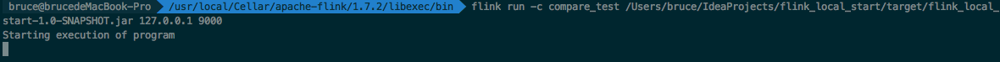
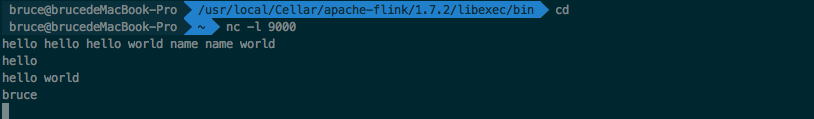
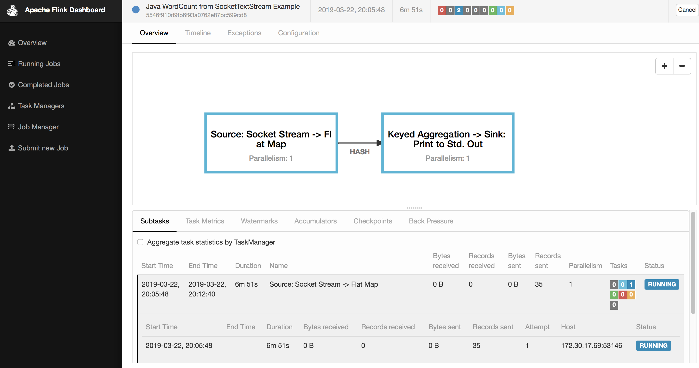
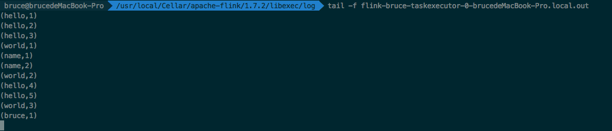

# 1、Flink 流计算框架调研

### 1.1 Flink 分布式执行
flink 分布式程序包含2个主要进程：JobManager and TaskManager<br>
- 首先，flink程序提交到JobClient，JobClient再提交到JobManager，JobManager负责资源的协调和Job的进行，一旦资源完成分片，task就会分配到不通的TaskManager，然后TaskManager就会初始化线程执行task。并根据程序的执行状态向JobManager反馈。当job执行完成，就会将结果反馈给客户端。<br>

- Flink 内部使用Akka模型作为JobManager 和 TaskManager的通信机制。

### 1.2 Flink 异步快照机制
采用 Asynchronous Barrier Snapshotting(异步栅栏快照)

### 1.3 Flink代码示例
```
import org.apache.flink.api.common.functions.FlatMapFunction;
import org.apache.flink.api.java.tuple.Tuple2;
import org.apache.flink.streaming.api.datastream.DataStreamSource;
import org.apache.flink.streaming.api.datastream.SingleOutputStreamOperator;
import org.apache.flink.streaming.api.environment.StreamExecutionEnvironment;
import org.apache.flink.util.Collector;

public class compare_test {
    public static void main(String[] args) throws Exception {
        //参数检查
        if (args.length != 2) {
            System.err.println("USAGE:\nSocketTextStreamWordCount <hostname> <port>");
            return;
        }

        String hostname = args[0];
        Integer port = Integer.parseInt(args[1]);


        // set up the streaming execution environment
        final StreamExecutionEnvironment env = StreamExecutionEnvironment.getExecutionEnvironment();

        //获取数据
        DataStreamSource<String> stream = env.socketTextStream(hostname, port);

        //计数
        SingleOutputStreamOperator<Tuple2<String, Integer>> sum = stream.flatMap(new LineSplitter())
                .keyBy(0)
                .sum(1);

        sum.print();

        env.execute("Java WordCount from SocketTextStream Example");
    }

    public static final class LineSplitter implements FlatMapFunction<String, Tuple2<String, Integer>> {
        @Override
        public void flatMap(String s, Collector<Tuple2<String, Integer>> collector) {
            String[] tokens = s.toLowerCase().split("\\W+");

            for (String token : tokens) {
                if (token.length() > 0) {
                    collector.collect(new Tuple2<String, Integer>(token, 1));
                }
            }
        }
    }
}


```
#### 1.3.1 上述代码build project，通过命令 mvn clean package -Dmaven.test.skip=true 打成jar包, 在flink安装目录运行下面命令：
> flink run -c class_name your_jar_path 127.0.0.1 9000


#### 1.3.2 在终端输入 nc -l 9000，输入如下单词


#### 1.3.3 在终端输入 http://localhost:8080 出现Dashboard。 


#### 1.3.4 在另一个终端打开，进入flink安装目录，然后显示输出，单词统计如下


# 2、influxdata技术栈
## 2.1 TIGK <br>
- T : Telegraf 数据采集<br>
- I : InfluxDB 开源数据库<br>
- G : Grafana 可视化监控服务<br> 
- K : Kapacitor 流处理框架<br>

## 2.2 Kapacitor 使用的是TICKscript， 包含了两种类型的任务：stream & batch。<br>
### 2.2.1 stream 任务的Tickscript 代码
```
dbrp "telegraf"."autogen"

stream
    // Select just the cpu measurement from our example database.
    |from()
        .measurement('cpu')
    |alert()
        .crit(lambda: int("usage_idle") <  70)
        // Whenever we get an alert write it to a file.
        .log('/tmp/alerts.log')
```
### 2.2.2 batch 任务的Tickscript 代码
```
dbrp "telegraf"."autogen"

batch
    |query('''
        SELECT mean(usage_idle)
        FROM "telegraf"."autogen"."cpu"
    ''')
        .period(5m)
        .every(5m)
        .groupBy(time(1m), 'cpu')
    |alert()
        .crit(lambda: "mean" < 70)
        .log('/tmp/batch_alerts.log')
```


