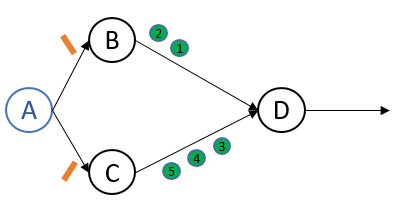
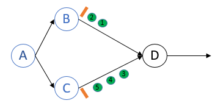
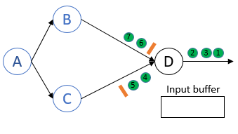
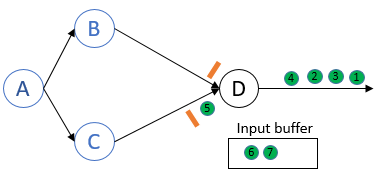
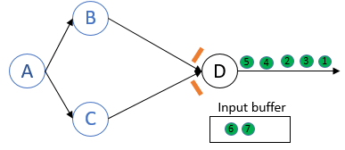
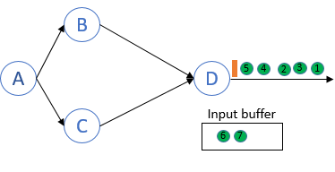
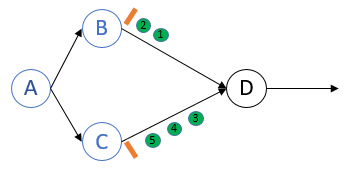
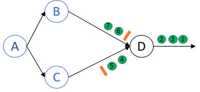
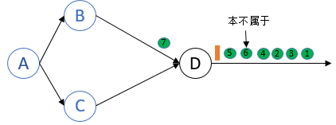

# 1、Flink 容错机制
## 1.1 Flink exactly once模式
flink实现exactly once策略，是flink会持续的对整个系统做snapshot，然后把全局状态(snaphot)根据设定好的路径保存到master node 或者是HDFS中，当系统出现failure时，flink停止处理数据，把系统恢复到最近的一次checkpoint
### 1.1.1 什么是global state(全局状态)
分布式系统由空间上分离的process和连接这些process的channel组成。空间上分立的含义就是process不共享memory，而是通过communication channel 上进行的message pass来异步通信交流。
分布式系统的global state 就是所有process，channel的集合。
process的local state取决于the state of local memory and the history of its activity。
channel的local state是从上游发送进channel的message集合减去下游process从channel接受的message的差集
分布式系统没有共享内存和全局时钟，如果分布式系统有共享内存，那么可以从共享内存中直接获取整个分布式系统的snapshot，不用分别获得各个process、channel的local state再组合成为一个global state。
未来获得一致性global state，采用chandy-Lamport算法
(该算法就是在数据中插入marker也就是barrier)
- <font size="3">at exactly once 模式</font><br/> 

如图所示：A是JobManager，B、C是source streaming，D是普通的算子
JobManager首先发起snapshot，所有source发送barrier。<br>

<br>

每个barrier先后到达各自的source。Source在收到barrier后记录自身的state，然后向下游发送barrier。<br>

<br>

barrier B 到达process D，但是不会进行snapshot，因为还有barrier C没有到达<br>

<br>

这个时候barrier B已经到达了process D，这个时候channel BD端6、7在process D端不会处理，将它们放到input buffer中。这个时候barrier C没有到达process D.<br>

<br>

这个时候barrier C也到达了process D，process D已经接受了上游所有的barrier。<br>

<br>

process D记录barrier，然后向下游发送barrier.<br>

<br>

- <font size="3">at least once 模式</font><br/> 
只要process接收到barrier之后，就立即开始做snapshot，然后process继续处理所有的channel的数据，后来的snapshot会覆盖之前的snapshot。<br>

barrier B 和 barrier C 向下游process D 传播：<br>

<br>

barrier B 先到达 process D，然后做snapshot<br>
<br>

数据点 6 不属于这次的checkpoint，但是却包含在 process D的 local state 中
<br>
在recovery的过程中，source认为数据点 6 还没被处理，所以重发一次 6，这样就造成streaming中会出现两个数据点 6 的情况。<br>

> <u>*造成这种情况的原因是在第二个barrier C到来之前，节点就已经做了一次snapshot*</u>


# 2、之前的问题
## 1：数据更新怎么办？
>因为数据是从消息队列读取的，所以只可能会添加，不会更新。<br>
## 2：watermark 水位线触发后，如果后面的数据仍旧满足的话怎么解决？
>在flink 的代码里，有一个设置maxOutOfOrder,这个是允许延迟的水位线的大小

```
private class OdpTimestampWatermark implements AssignerWithPeriodicWatermarks<BayMaxOdpEvent> {
        private static final long serialVersionUID = 4037153629686337454L;
        private final long maxOutOfOrder = 60000;

        private long currentMaxTimestamp;

        @Override
        public long extractTimestamp(BayMaxOdpEvent element, long previousElementTimestamp) {
            Long timestamp = element.getT();
            currentMaxTimestamp = Math.max(timestamp, currentMaxTimestamp);
            return timestamp;
        }

        @Override
        public Watermark getCurrentWatermark() {
            return new Watermark(currentMaxTimestamp - maxOutOfOrder);
        }
    }

```


> 下周计划，实现一个简单的流式系统，能够打通流的一个版本。