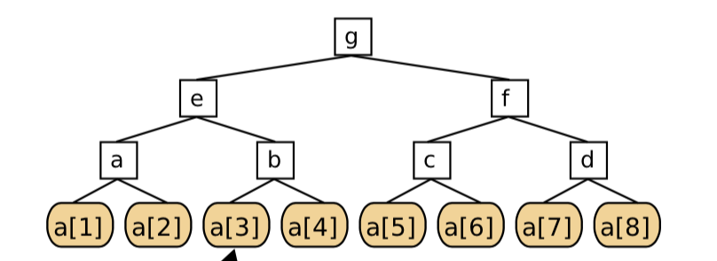
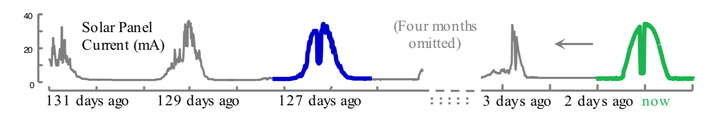
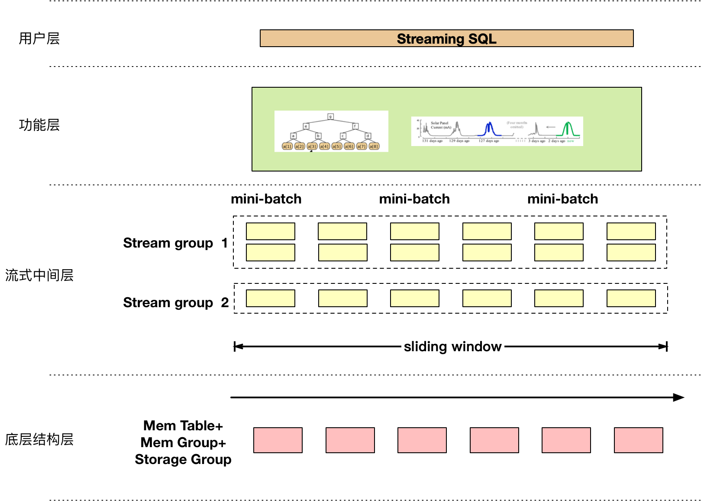

# IoTDB 流框架功能与详细设计文档

| 版本 | 说明                   | 编写/修改人  |
| ---- | ---------------------- | ------------ |
| V0.1 | 新建                   | 黄向东，康荣 |
| V0.2 | 增加文档结构与部分章节 | 黄向东，康荣 |


[TOC]


## 第1章 IoTDB流框架设计目标

### 1.1 流数据概述

随着物联网和工业互联网的迅猛发展，世界上每天会产生大量的时序数据。而流数据（steaming data）是时序数据中的一种重要形式，同时也成为近十年来数据库领域最热门的研究方向之一。相比于传统的关系型数据和工业数据，流数据具有以下特点：

* 到达速度快：流数据到达速度快，甚至会超出正常数据库的写入性能上限，因此在流数据的处理和分析中，通常无法将全部数据暂存到内存中。另外，流数据处理可能作为一种数据预处理和降采样的手段，使得高频数据缩减到可以被数据库处理。
* 实时性要求高：由于流数据到达速度快，用户可能并不要求将全部的流数据落盘，而仅仅是对最近一部分流数据进行实时处理，因此，流数据的分析也不允许过于频繁的访问磁盘。
* 到达频率相对稳定：流的到来通常是连续不断地，这也意味着流数据的处理也是连续不断的过程。如果处理过程有输出，通常输出结果也是"流数据"的形式。另外，稳定的到达频率使得流数据处理中产生了时间跨度固定的"滑动窗口"等概念。

### 1.2 现有技术

著名的`InfluxData公司`针对实时监控需求，开发了`TICK技术栈`。`TIGK技术栈`是一个开源的监控方案，由`Telegraf`（agent采集工具），`InfluxDB`（时序数据库存储），`Chronograf`（可视化工具），`Kapacitor`（监控告警工具）四部分组成。其中，Kapacitor是TIGK技术栈的告警服务，用户通过编写tickScript脚本来对时序数据库当中的数据进行过滤，筛选，批处理等进行告警，告警信息可以通过日志保存在本地，或**回写**到influxdb，还可以直接在告警产生后发起http请求到指定地址。kapacitor支持数据流（stream）和批处理（batch）数据两种工作模式。


### 1.3 设计目标

但是，时序数据与流数据的联系是如此的紧密与天然，以至于用户通常认为时序数据库天然就应该支持流数据处理，而不是额外安装一个软件。数据读写和分析软件的天然入口是**SQL**或与SQL相适应的jdbc和api接口。将流数据处理功能通过SQL命令触发，无疑是对用户最友好的方式。

同时，流数据框架如果独立出来，势必要进行大量数据写入与输出、安全备份、崩溃数据恢复的功能，而这些功能在IoTDB中已经有了较为完整的实现。对于现阶段开发而言，最可行便捷的方案是将流框架作为IoTDB Engine中的一个模块，充分依赖已成熟的功能模块，提升开发效率，减轻开发工作量。

综上，我们希望将流框架设计为IoTDB的一个模块，流框架的功能通过SQL触发。与`TICK技术栈`通过结合一系列独立的软件从而提供服务不同，`IoTDB流框架`的设计目标是IoTDB数据库功能的补充与完善。

流框架的设计目标如下：

1. 长时服务支持：目前IoTDB仅支持即时查询，无法提供长期运行的监控和统计任务。流框架允许用户在这一场景下运行任务。
2. 面向流数据的丰富语义：流框架支持丰富而自定义的聚合、模式匹配、预警任务，同时允许用户自定义任务。
3. 可控的内存占用：整个流框架的内存消耗应该可控，允许通过配置参数来限制内存上界。
4. 极低的响应时间：基于流数据处理特点进行优化，达到极低的响应时间。
5. 可靠的数据安全：利用自身的备份机制，同时结合IoTDB的写前日志、恢复机制来保证流框架的数据安全。
6. 极低的学习门槛：通过SQL语句进行流数据任务的指定、运行、停止、查询等功能，将用户的学习成本和额外开销降到最低。
7. 数据预处理与降采样（疑）：在写入IoTDB之前，由流框架完成降频等需求，使IoTDB得以处理更高频的写入需求。


### 1.4 应用场景

#### 1.4.1 流数据聚合（Aggregation）

对于滑动窗口中任意一段数据提供丰富的聚合操作，包括但不限于均值、最大最小值、中位数、方差等。



工作基础：Huang X, et al. Pisa: An index for aggregating big time series data. CIKM 2016

参考实现：Tangwongsan, et al, “General Incremental Sliding-Window Aggregation.” VLDB 2015: 702–713.

#### 1.4.2 流数据模式匹配（monitor）

给定模式和阈值，对于流数据持续监控并返回与模式之间距离小于阈值的片段。


> 工作基础： Kang, Rong, et al. “Matching Consecutive Subpatterns over Streaming Time Series.” APWEB-WAIM, 2018.
>
> 参考实现：Lian, Xiang, et al. “Efficient Similarity Search over Future Stream Time Series.” TKDE 2008.


#### 1.4.3 重复模式检测（motif）

对于一段时间序列，检测反复出现的相似片段，如果这些片段之间的距离小于阈值，返回这些片段。



>  参考实现：Begum, et al. “Rare Time Series Motif Discovery from Unbounded Streams.” PVLDB 2014.


#### 1.4.4 异常点检测（outlier detection）

对于窗口内与其他点距离超过阈值的点视为异常点，返回异常点或异常片段。


> 参考实现：Kontaki, M.,et al. “Continuous Monitoring of Distance-Based Outliers over Data Streams.” ICDE 2011.


## 第2章 IoTDB流框架的总体设计

### 2.1 流框架相关的定义

* 时序数据流：由一系列<时间-值>对组成的序列。一条时序流必须是IoTDB的中创建好的一条序列。
* 数据时间与到达时间：虽然时序流的每个值对的时间戳称为"数据时间”，而IoTDB会维护一个系统时间，值对到达系统的时间称为“到达时间”。通常到达时间要晚于数据时间。流框架根据到达时间决定对乱序数据的处理方式。
* 流组：IoTDB流框架暂不支持多维数据点，但支持将多条时间序列设为流组。(存疑：因为并不强制只有同一个流组的流才能同时输入到单个任务中，另外流组和Storage group并没有强制绑定关系，这样流组的概念就没有意义了)
* 滑动窗口：所有流只维护最近的一段数据。可以是最近n个点或最近 n 毫秒。
* 任务：以一条或多条序列作为输入，处理后产生一条或多条新的数据流并输入到HTTPS或写入IoTDB。一个任务中的所有输入序列的滑动窗口参数保持一致，同时要指定对齐策略。


### 2.2 流框架总体架构图



## 第3章 IoTDB流框架的功能设计

### 3.1 数据预处理

存疑：流框架的其他部分均在数据写入BufferWrite之后再推送给流框架，而数据预处理发生在写入BufferWrite之前，似乎应该把它和流框架分离开。

### 3.2 定义流数据任务


### 3.3 启动、终止流数据任务


### 3.4 查看流数据任务


## 第4章 IoTDB流框架的接口设计

### 4.1 IoTDB StreamQL设计

以下给出StreamSQL支持的命令的语法、参数定义和示例。

其中，identifier由数字、英文字母和下划线组成，leteral由英文字母和符号组成，而string则仅有任意个英文字母组成。每一个由单引号包括的部分，都表示直接对应的字母或符号。每一个由尖括号'<'和'>'包括的部分，都由更基础的成分组成。符号':='表示了这种组成关系。

注意大写的英文表示固定的关键词，在具体编写命令时，是大小写兼容的。

参考`Jain N, et al. Towards a streaming SQL standard. VLDB, 2008` ，所有流数据处理的语句均以`STREAM`开头。


#### 定义流数据任务

```sql
-- 语句描述：定义任务；
-- 语句定义：
STREAM CREATE TASK <taskType> ON <seriesList> WITH WINDOW <windowParam> DO <taskBody>

-- 语句示例：最近200个点组成window
STREAM CREATE TASK AGGREGATION 
ON root.laptop.d1.s1 
WITH WINDOW WindowType=COUNT AND LIMIT=200 
DO COUNT

-- 语句示例：最近5000ms的点组成window，取MAX
STREAM CREATE TASK AGGREGATION 
ON root.laptop.d1.s1 
WITH WINDOW WindowType=TIME AND LIMIT=5000 
DO MAX


```

 

#### 启动、终止流数据任务

```sql
--启动任务
STREAM START TASK <taskType> ON <seriesList>

--终止任务
STREAM STOP TASK <taskType> ON <seriesList>
```


#### 查看流数据任务

```sql
--查看任务
STREAM SHOW TASK <taskTypeList> ON <seriesList>

--查看 root.laptop.d1.s1 的所有任务
STREAM SHOW TASK * ON root.laptop.d1.s1

--查看 root.laptop.d1.* 的所有聚合任务(Aggregation)
STREAM SHOW TASK AGGREGATION ON root.laptop.d1.*
```


### 4.2 开发API接口设计

**TODO**


## 第5章 IoTDB流框架的详细设计

### 5.1 数据预处理

TODO

### 5.2 流框架逻辑结构

流框架由StreamManager统一管理，负责在IoTDB启动时启动，响应创建流框架任务，并对于正在执行的任务，创建相应的Processor。系统崩溃后，也由Manager完成恢复工作。

### 5.3 划分流组(Stream Group)


### 5.3 滑动窗口(Sliding Window)


### 5.4 流数据状态(Stream State)


### 5.5 流数据读入与对齐


### 5.6 流数据读入：乱序


### 5.7 流数据处理：通用算子


### 5.8 流数据处理：特定开发功能


### 5.9 流数据写出


### 5.10 流数据状态备份与恢复


## 第6章 IoTDB流框架与其他模块的交互

### 6.1 查询处理模块(QueryProcessor)

所有SQL语句(包括DDL、DML和DQL)都需要经过QueryProcessor的解析。需要增加以下功能：

1. Antlr解析：在`Parser.g`中增加StreamQL的定义。
2. 增加查询处理算子：支持流框架新增的操作类型(同样继承`org.apache.iotdb.db.qp.logical.Operator`)

### 6.2 写缓存模块(BufferWrite)

流框架的数据来源直接从BufferWrite的Memory读取。需要支持以下功能：

1. 增加查询api：指定序列路径(Path)，指定时间范围或返回点数量，返回相应序列；
2. 增加写入api：指定序列路径(Path)，给定一段序列(数组形式)，将序列写入到BufferWrite中；
3. 修改LRU策略：正在运行的流处理任务所涉及的序列，所属的`FileNode`不会从`FileNodeManager`中移除(这一要求存疑)

### 6.3 读取模块

对于正在运行的流处理任务，如果允许它对应的FileNode被轮换移除，则当再次


## 第7章 IoTDB流框架的类包接口设计

### 7.1 StreamManager

```java
public class StreamManager{
  // 初始化流框架
  public static void init();
}
```

### 7.2 StreamProcessor

```java
public class StreamProcessor{
  // 初始化流框架
  public static void init();
}
```


### 7.3 StreamRecover

```java
public class StreamRecover{
  // 初始化流框架
  public static void init();
}
```

### 7.4 StreamState

```java
public class StreamState{
  // 初始化流框架
  public static void init();
}
```

### 7.5 StreamSlidingWindow

```java
public class StreamSlidingWindow{
  // 初始化流框架
  public static void init();
}
```

